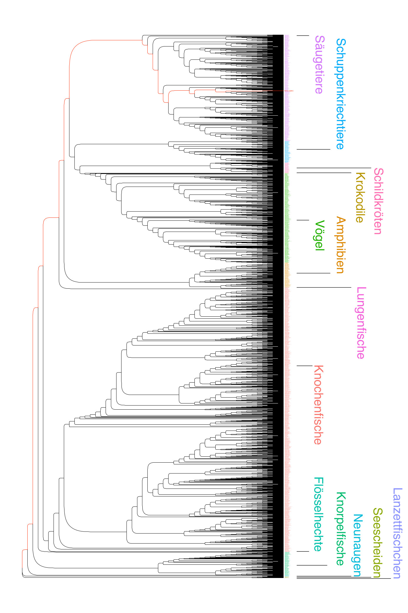

# Reconstructing the relationship among chrodates using genomic data

We use data from the [RefSeq](https://www.ncbi.nlm.nih.gov/refseq/)-database of the [National Center for Biotechnology Information (NCBI)](https://www.ncbi.nlm.nih.gov/) to reconstruct the phylogenetic tree displayed in the glass cabinet of the NHM. This database is [rapidly growing](https://www.ncbi.nlm.nih.gov/refseq/statistics/) due to recent advances in sequencing technology and contains more than 100,000 curated and complete genomes of diverse organisms by 2022. The RefSeq-database not only provides access to DNA sequences, but also to aminoacid sequences of transcribed genes. Aminoacids are the building blocks of proteins which are encoded by DNA codons (triplets of consecutive DNA nucleotides). The sequence of aminoacids in the RefSeq was generated by bioinformatic tools to transcribe the DNA sequence of known genes. Since aminoacid sequences are usually more conserved than the underlying DNA sequences, these data are well suited to reconstruct the phylogenetic relationship of even distantly related taxa. In our case we focus on the genome of mitochondria, which are cell organelles of bacterial origin that act as the cellular powerplants of eukaryotic organisms.


Powerful computers with sufficient RAM memory (>100GB) and multicore processors (>100 cores) are required to carry out compuationally demanding analyes. Additionally, the operation system should be UNIX-based, which allows to commit tasks to the computer via the commandline. If you are interested in learning more about UNIX and the basics of bioinformatics analyses, you can find useful tutorials and other resources on the internet, such as [here](http://www.ee.surrey.ac.uk/Teaching/Unix/index.html) and [here](https://practicalcomputing.org/).

Below, we present the basic analysis steps underlying the phylogenetic reconstruction of chordates (as shown in the glass cabinet). Since the number of taxa in the RefSeq database is constantly increasing, the resulting tree may differ from our original tree.

## (1) Downloading the sequencing data

At first, we download the dataset with aminoacid and DNA sequences of mitochondrial genomes for all available taxa. Based on the metainfomation from the individual sequences, we generate a database of names for all organisms in the dataset at different hierarchical levels (e.g., species, genus, family, order, etc.).

Additionally required programs:

-   [NCBI-edirect](https://www.ebi.ac.uk/Tools/msa/muscle/Tools/NCBIedirect)

```bash
## make directory
mkdir ~/PhylogenyDIY/data

## go to directory
cd ~/PhylogenyDIY/data

## download aminoacid sequence dataset
wget https://ftp.ncbi.nlm.nih.gov/refseq/release/mitochondrion/mitochondrion.1.protein.faa.gz

## download DNA sequence dataset
wget https://ftp.ncbi.nlm.nih.gov/refseq/release/mitochondrion/mitochondrion.1.1.genomic.fna.gz

## simplify the header of the DNA FASTA file and only retain the name of the Species
gunzip -c mitochondrion.1.1.genomic.fna.gz \
  | awk '{if ($1~"^>") {print $1"_"$2"_"$3} else {print}}' \
  > mitochondrion.1.1.genomic_fixed.fasta

gunzip -c mitochondrion.1.1.genomic.fna.gz \
  | awk '{if ($1~"^>") {print substr($1,2)}}' \
  > mitochondrion.1.1.genomic_fixed.list

### now get the taxonomy table for each RefSeq entry
module load Tools/NCBIedirect
while read -r line
do
  #echo $line
  ID=`esearch -db nucleotide -query ${line} < /dev/null |esummary | xtract -pattern TaxId  -element TaxId `
  ID2=`efetch -db taxonomy -id ${ID} -format xml | xtract -pattern Taxon -tab "," -first TaxId ScientificName \
    -group Taxon -KING "(-)" -PHYL "(-)" -CLSS "(-)" -ORDR "(-)" -FMLY "(-)" -GNUS "(-)" \
    -block "*/Taxon" -match "Rank:kingdom" -KING ScientificName \
    -block "*/Taxon" -match "Rank:phylum" -PHYL ScientificName \
    -block "*/Taxon" -match "Rank:class" -CLSS ScientificName \
    -block "*/Taxon" -match "Rank:order" -ORDR ScientificName \
    -block "*/Taxon" -match "Rank:family" -FMLY ScientificName \
    -block "*/Taxon" -match "Rank:genus" -GNUS ScientificName \
    -group Taxon -tab "," -element "&KING" "&PHYL" "&CLSS" "&ORDR" "&FMLY" "&GNUS"`
  echo ${line}","$ID2
done < mitochondrion.1.1.genomic_fixed.list > mitochondrion.1.1.genomic_fixed_taxon.list

## convert the table to rename the tips of the trees with species names
awk -F "," '{split($1,a,"."); print a[1]".:"$3}' mitochondrion.1.1.genomic_fixed_taxon.list \
  > mitochondrion.1.1.genomic_fixed_taxon.txt

## isolate the class taxonomic level to color code the tree
awk -F "," '$1!~/""/{split($3,a," "); print a[1]"_"a[2]"\t"$6}' mitochondrion.1.1.genomic_fixed_taxon.list \
  | grep -v "^_"  > mitochondrion.1.1.genomic_fixed_taxon.colors
```

## (2) Filtering the dataset

The downloaded dataset contains the aminoacid sequences of mitochondrial genomes for all available taxa. Using a script ([proteins2genome.py](scripts/proteins2genome.py)) written in the programming language _Python_, we isolate sequencing data of chordates only. Additionally, we reduce the dataset to genes, which are present in more than 90% of all taxa and concatenate the aminoacid sequences of all genes in the same order for each taxon in the dataset.

```bash
## make new directory
mkdir -p ~/PhylogenyDIY/results

cd ~/PhylogenyDIY

## here, we reduce the FASTA file to contain only genes that are present in 90% of all taxa that belong to the Chordates and concatenate the sequence of all retained genes per taxon
python ~/PhylogenyDIY/scripts/proteins2genome.py \
  --TaxList data/mitochondrion.1.1.genomic_fixed_taxon.list \
  --Tax Chordata \
  --FreqTH 0.90 \
  --input data/mitochondrion.1.protein.faa.gz  \
  > results/mitochondrion.1.protein_Chordata.fasta
```

## (3) Alignment of the sequencing data

Nun sind die Aminosäuresequenzen der einzelnen Taxa entsprechend der Gene geordnet und zu einer langen Kette von Aminosäuren verbunden. Diese Kette berücksichtigt aber keine "strukturellen" Mutationen, wie Insertionen oder Deletionen, die zur Verschiebung der relativen Positionen von Aminosäuren gleichen Ursprungs in verschiedenen Taxa führen kann. Durch ein sogenanntes Alignment werden zusammengehörige Aminosäuren in Spalten übereinander geordnet, wobei jede Zeile die Sequenzdaten eines Taxons enthält. Positionen mit "Löchern" aufgrund von strukturellen Mutationen werden mit einem `-` Symbol aufgefüllt. Dieser kritische Schritt ist notwendig um Merkmale gleichen Ursprungs, in unserem Fall, Aminosäuren an der gleichen Sequenzposition, über Taxa hinweg miteinander zu vergleichen und so genetische Unterschiede erkennen zu können. Die zugrunde liegenden Algorithmen sind sehr rechenintensiv, weshalb wir die Rechenlast auf 200 Prozessorkerne aufteilen.  

MAFFT verändert die Metainformation der ursprünglichen Daten, was zu einem Problem führt, wenn die ursprünglichen Taxon-Namen für die Benennung der Astenden des Stammbaums benutzt werden sollen. Ein eigenes Skript ([fixIDAfterMafft.py](scripts/fixIDAfterMafft.py)) wird deshalb benutzt um die ursprüngliche Metainformation wieder herzustellen. In einem weiteren Schritt entfernen wir ([reduceAln2FASTA.py](scripts/reduceAln2FASTA.py)) Positionen an welchen mehr als 50% aller Individuen ein `-` Symbol enthalten. Dies soll verhindern, dass eine hohe Anzahl an nicht-informativen Positionen die Rekonstruktion von Verwandtschaftsverhältnisse verzerrt.  

Benötigte zusätzliche Programme:

-   [MAFFT](https://mafft.cbrc.jp/alignment/software/)

```bash
conda activate mafft-7.487

cd ~/PhylogenyDIY

## carry out the alignment with MAFFT
mafft \
  --thread 200 \
  --auto \
  results/mitochondrion.1.protein_Chordata.fasta \
  > results/mitochondrion.1.protein_Chordata_aln_full.fasta

## fix ID's after MAFFT alignment
python  ~/PhylogenyDIY/scripts/fixIDAfterMafft.py \
  --Alignment ~/PhylogenyDIY/results/mitochondrion.1.protein_Chordata_aln_full.fasta \
  --input ~/PhylogenyDIY/results/mitochondrion.1.protein_Chordata.fasta \
  > ~/PhylogenyDIY/results/mitochondrion.1.protein_Chordata_aln_full_fixed.fasta

## only retain Position where less than 50% of all taxa have gaps
python ~/PhylogenyDIY/scripts/reduceAln2FASTA.py \
  --input results/mitochondrion.1.protein_Chordata_aln_full_fixed.fasta  \
  --threshold 0.5 \
  > results/mitochondrion.1.protein_Chordata_aln.fasta

## replace ambiguous AA with gaps
sed -i '/^>/! s/[BJZX]/\-/g' ~/PhylogenyDIY/results/mitochondrion.1.protein_Chordata_aln.fasta
```

Das Hintergrundbild in der Vitrine und das untere Bild sind Beispiele für ein solches Alignment basierend auf DNA-Sequenzen.


## (4) Stammbaum-Rekonstruktion mit Hilfe des Maximum-Likelihood Verfahrens

Der aufbereitete Datensatz kann nun benutzt werden, um die Verwandtschaftsbeziehung der einzelnen Taxa anhand von Sequenz-Unterschieden abzuschätzen. Dazu wird ein maximum-likelihood Verfahren angewandt, bei der die Wahrscheinlichkeit verschiedener Baum-Topologien, also mögliche Verwandtschaftsbeziehungen zwischen den einzelnen Taxa, verglichen werden. Ziel ist es den Stammbau zu finden, welcher am besten zu der Sequenzdatenmatrix passt, wenn man spezifische Annahmen zum evolutionären Ablauf macht, z.B.: wie häufig eine Aminosäure auf Grund von Mutationen durch eine andere ersetzt wird. Dieser Rechenschritt ist äußerst rechenintensiv, da sehr viele verschiedenen Baum-Topologien miteinander verglichen werden. Wir verteilen die Rechenlast deshalb wieder auf 200 Prozessorkerne.

Benötigte zusätzliche Programme:

-   [RAxML](https://cme.h-its.org/exelixis/web/software/raxml/)

```bash
module load Phylogeny/RAxML-2.8.10

## make new directory
mkdir ~/PhylogenyDIY/results/raxml
cd ~/PhylogenyDIY/results/raxml

## run ML tree reconstruction
raxmlHPC-PTHREADS-SSE3 \
  -m PROTGAMMAWAG  \
  -N 20 \
  -p 772374015 \
  -n Chordata_const \
  -s ../mitochondrion.1.protein_Chordata_aln.fasta \
  -# 3 \
  -T 200
```

Im Anschluss müssen noch die Taxon-IDs aus den ursprünglichen Metadaten mit Hilfe eines zusätzlichen Skripts ([RenameTreeLeaves_new.py](scripts/RenameTreeLeaves_new.py)) durch korrekte Artnamen ersetzt werden. Außerdem bestimmen wir mit Hilfe eines weiteren Scripts ([MakeOutgroup.py](scripts/MakeOutgroup.py)), welche Taxa zu den Klassen _Hyperoartia_, _Ascidiacea_ und _Leptocardii_ gehören, die wir als Außengruppen für die visuelle Darstellung des Baums definieren.

```bash
python ~/PhylogenyDIY/scripts/RenameTreeLeaves_new.py \
  --input ~/PhylogenyDIY/results/raxml/RAxML_bestTree.Chordata_const \
  > ~/PhylogenyDIY/results/raxml/RAxML_bestTree_renamed.Chordata_const

outgroup=`python ~/PhylogenyDIY/scripts/MakeOutgroup.py --tree ~/PhylogenyDIY/results/iqtree_const/mitochondrion.1.protein_Chordata_aln.fasta_renamed.parstree --taxa ~/PhylogenyDIY/data/mitochondrion.1.1.genomic_fixed_taxon.list --list Hyperoartia,Ascidiacea,Leptocardii`
```

Schlussendlich erstellen wir mit Hilfe der Programmiersprache _R_ eine visuelle Darstellung des besten Stammbaum-Modells, welches mit RAxML identifiziert wurde

```R
# load necessary R libraries
library('ggtree')
library('gridExtra')
library('ggrepel')
library('ape')
library('ggplot2')
library('phangorn')
library('ggimage')
library('dplyr')
library('plotly')

## load tree file and root with outgroup taxa
tree<-read.tree('~/PhylogenyDIY/results/raxml/RAxML_bestTree_renamed.Chordata_const')
tree<-root(tree,outgroup=c($outgroup))

## load color information for highlighting different orders in different colors
Col=read.table('~/PhylogenyDIY/data/mitochondrion.1.1.genomic_fixed_taxon.colors',
header=F)
colnames(Col)<-c('tip','cat')

## plot tree
phylo.tree <- ggtree(tree,
layout='roundrect',
lwd=.1,
branch.length='none')+
theme_tree2()+
theme_bw()+
xlab('av. subst./site') +
theme(axis.title.y=element_blank(),
  axis.text.y=element_blank(),
axis.ticks.y=element_blank())+
theme(legend.position='bottom') +
scale_colour_discrete('Orders')+
theme(legend.title = element_text(size=10))+
theme(legend.text = element_text(size=8))+
guides(color = guide_legend(override.aes = list(size = 3)))

phylo.tree <- phylo.tree  %<+% Col+
geom_tiplab(aes(color=cat), size = 0.2)

## export tree
ggsave(filename='~/PhylogenyDIY/results/raxml/tree_rect.pdf',
  phylo.tree,
  width=10,
  height=30,limitsize=F)
```

Der Baum der unterhalb und in der Geschichtsvitrine gezeigt wird, wurde mit Hilfe von Graphikprogrammen nachbearbeitet. So wurden, z.B. die ursprüngliche Legende entfernt und durch eine vertikale Beschriftung der Klassen mit deutschen Namen ersetzt. Außerdem wurden die Äste mancher Taxon-Gruppen um die X-Achse rotiert, was den Baum nicht verändert, aber die Lesbarkeit verbessert.


